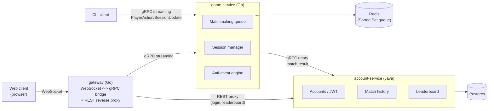

# match-arena

A polyglot (Go + Java) multiplayer matchmaking and real-time game session backend, built as a learning project. The "
game" itself is a thin vehicle (a reaction-time / click-race style game) — the real focus is the backend engineering:
real-time streaming, matchmaking, concurrency, and anti-cheat detection.

## Architecture



## Tech stack

- **Go** — `game-service`: matchmaking, real-time session state, anti-cheat engine, gRPC server; also hosts the
  `gateway` binary (WebSocket↔gRPC bridge + REST proxy, so the browser client never needs to speak gRPC directly).
- **Java / Spring Boot** — `account-service`: accounts, JWT issuance, match history, leaderboard, REST API.
- **gRPC** (via [buf](https://buf.build)) — bidirectional streaming for live session events, unary for matchmaking and
  cross-service calls.
- **Redis** — skill-based matchmaking queue (Sorted Set).
- **PostgreSQL** — account/match persistence.
- **Docker Compose** — full-stack local orchestration.

## Repo structure

```
proto/                     shared .proto contracts (game session, matchmaking, account lookups)
game-service/               Go — matchmaking, sessions, anti-cheat, gRPC server
  cmd/server/                game-service's gRPC server entrypoint
  cmd/gateway/                gateway entrypoint (WebSocket<->gRPC bridge, REST proxy, serves client/web)
  Dockerfile / Dockerfile.gateway
account-service/            Java/Spring Boot — accounts, JWT, match history, leaderboard, REST API
  Dockerfile
client/cli/                 command-line client streaming simulated player actions (real gRPC, no gateway needed)
client/web/                 zero-dependency HTML/CSS/JS web client, served by the gateway
docker-compose.yml           full stack: postgres, redis, account-service, game-service, gateway
```

## Running locally

**Docker Compose** (recommended — brings up everything):
```
cp .env.example .env   # fill in JWT_SECRET, e.g. `openssl rand -base64 48`
docker compose up --build
```
Then open `http://localhost:8081` for the web client. `account-service` REST is on `:8080`, its gRPC on `:9090`;
`game-service` gRPC is on `:9091`.

**Without Docker**: run Postgres and Redis yourself, then start each service with a shared `JWT_SECRET` env var
(`account-service` and `game-service` must use the *identical* value or token validation fails):
```
(cd account-service && JWT_SECRET=... ./mvnw spring-boot:run)
(cd game-service && JWT_SECRET=... go run ./cmd/server)
(cd game-service && go run ./cmd/gateway)
```