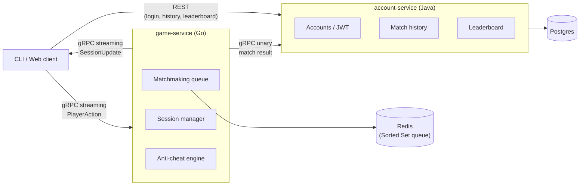

# match-arena

A polyglot (Go + Java) multiplayer matchmaking and real-time game session backend, built as a learning project. The "
game" itself is a thin vehicle (a reaction-time / click-race style game) — the real focus is the backend engineering:
real-time streaming, matchmaking, concurrency, and anti-cheat detection.

## Architecture



## Tech stack

- **Go** — `game-service`: matchmaking, real-time session state, anti-cheat engine, gRPC server.
- **Java / Spring Boot** — `account-service`: accounts, JWT issuance, match history, leaderboard, REST API.
- **gRPC** (via [buf](https://buf.build)) — bidirectional streaming for live session events, unary for matchmaking and
  cross-service calls.
- **Redis** — skill-based matchmaking queue (Sorted Set).
- **PostgreSQL** — account/match persistence.
- **Docker Compose** — full-stack local orchestration (later phase).

## Repo structure

```
proto/           shared .proto contracts (game session, matchmaking, account lookups)
game-service/    Go — matchmaking, sessions, anti-cheat, gRPC server
account-service/ Java/Spring Boot — accounts, JWT, match history, leaderboard, REST API
client/cli/      command-line client streaming simulated player actions
client/web/      minimal web client, for demoability
```